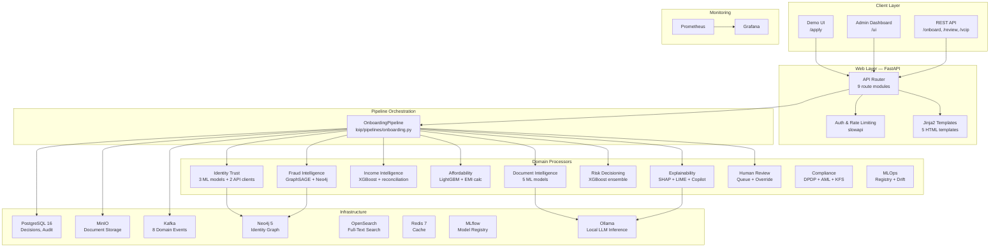
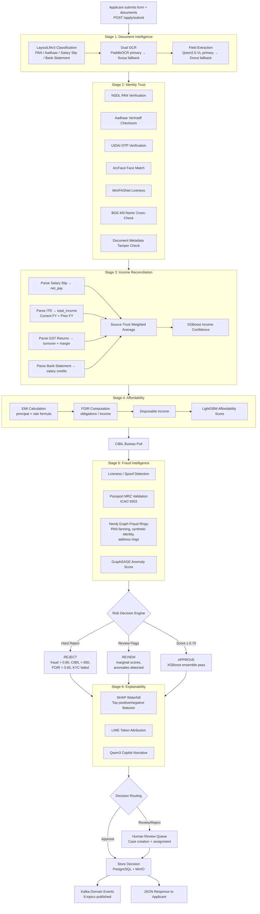
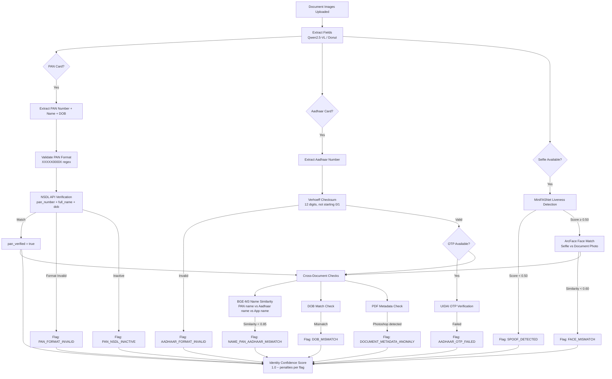
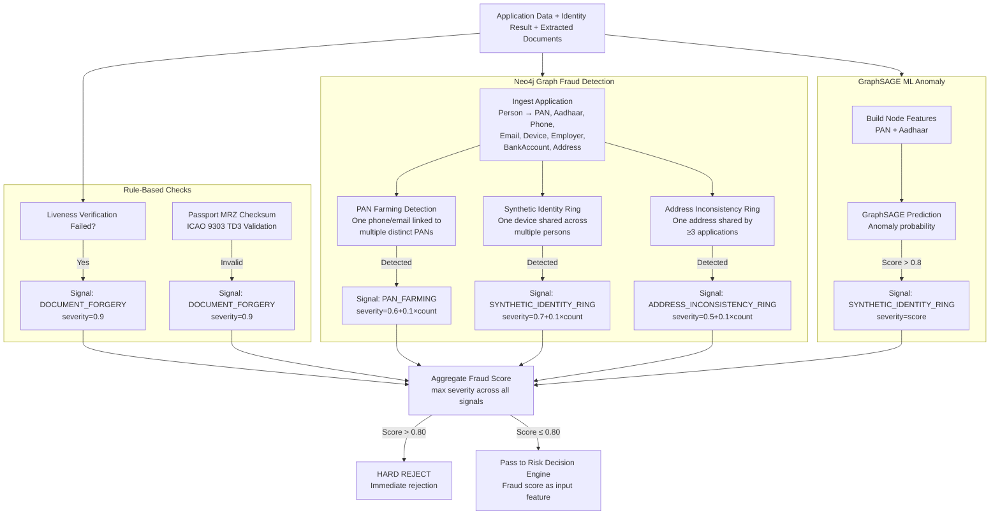
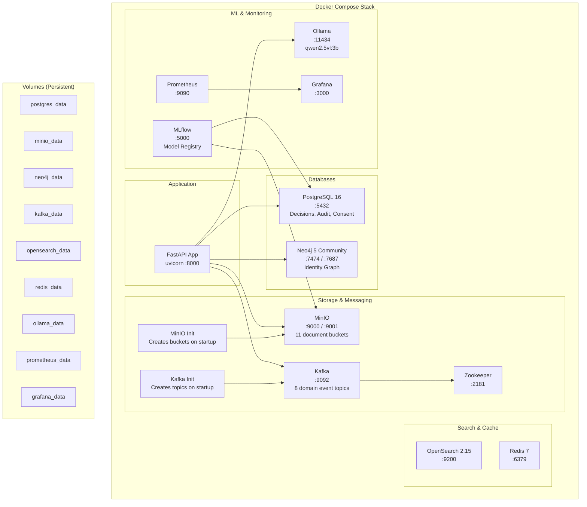
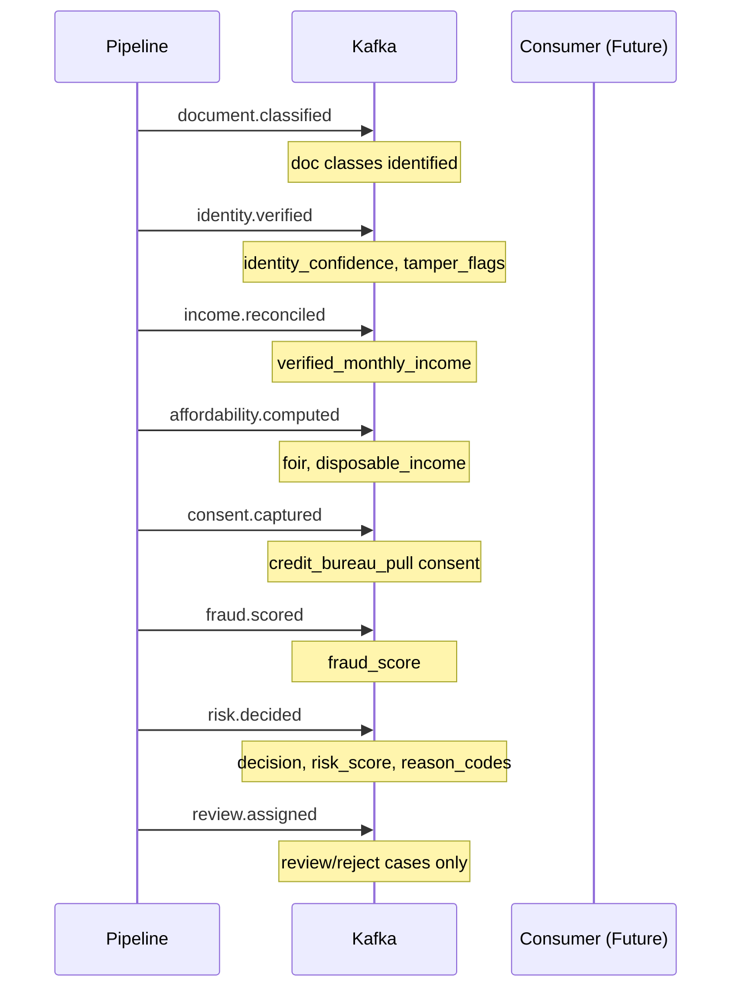
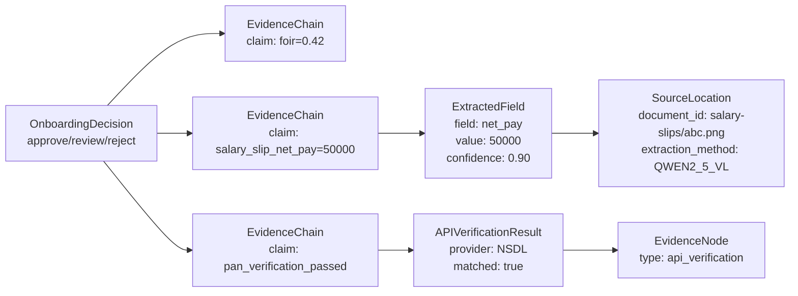
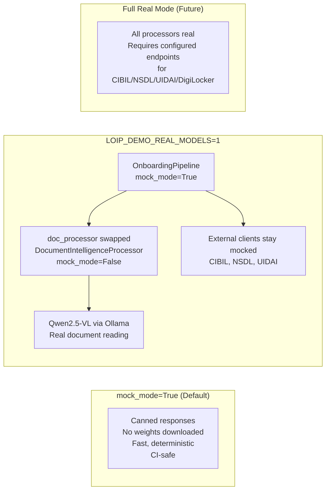

# LOIP Architecture

## System Architecture

## End-to-End Loan Onboarding Flow

## KYC Verification Flow

## Fraud Detection Pipeline

## Deployment Architecture

## Domain Event Flow (Kafka)

## Evidence Traceability Model

Every field that contributes to the final decision carries an **evidence chain** linking it back to its source document:

## Data Flow: Mock vs Real Mode

## Technology Stack

| Layer | Technology |
|-------|-----------|
| **Language** | Python 3.11+ |
| **Web Framework** | FastAPI + Uvicorn |
| **Templates** | Jinja2 |
| **ORM** | SQLAlchemy 2.0 (async) |
| **Migrations** | Alembic |
| **Validation** | Pydantic v2 + pydantic-settings |
| **Database** | PostgreSQL 16 (asyncpg) |
| **Object Storage** | MinIO (S3-compatible) |
| **Message Broker** | Kafka (aiokafka) |
| **Graph Database** | Neo4j 5 (neo4j-driver) |
| **Search** | OpenSearch 2.15 |
| **Cache** | Redis 7 |
| **ML Inference** | Ollama (local), HuggingFace Transformers |
| **ML Tracking** | MLflow |
| **Monitoring** | Prometheus + Grafana |
| **CI/CD** | GitHub Actions |
| **Containerization** | Docker Compose |
