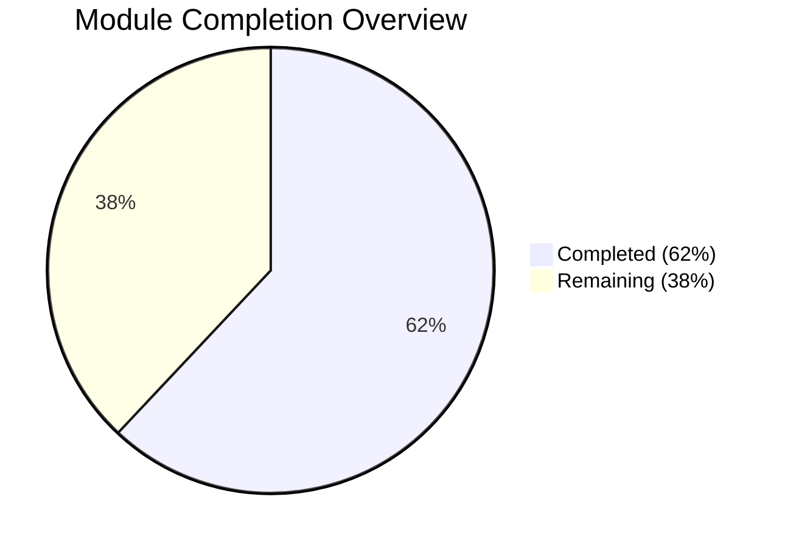
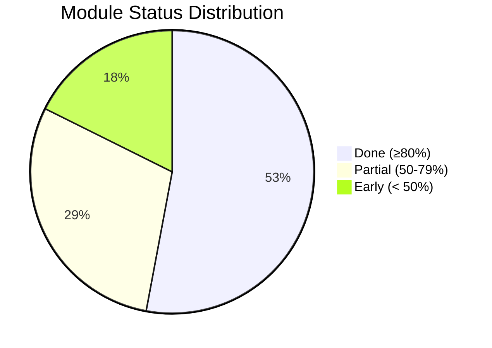
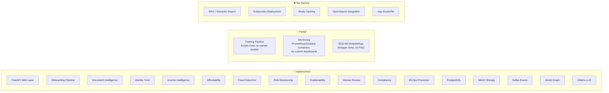
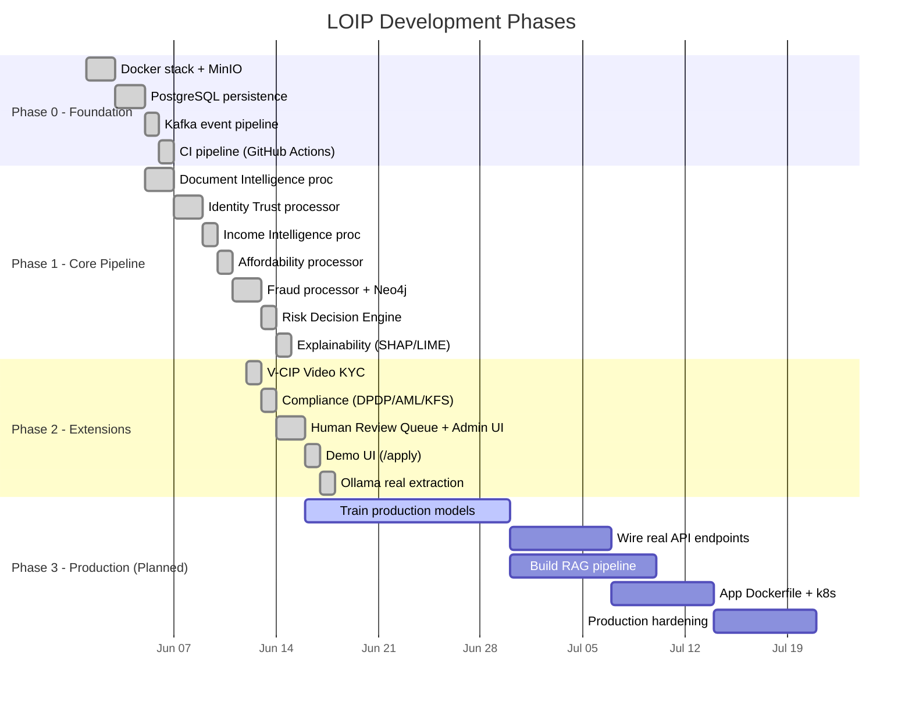
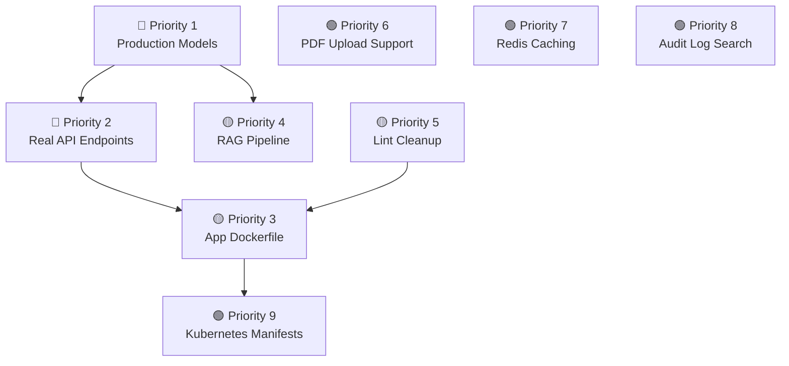
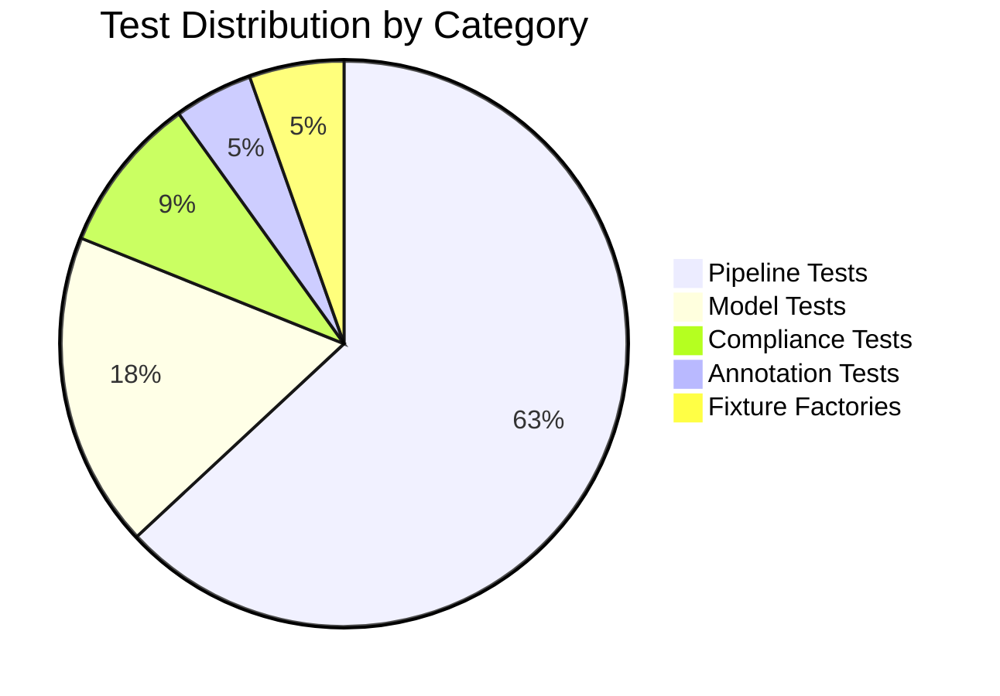

# LOIP Project Dashboard

> A new engineer should understand the project status within 5 minutes of reading this page.

## Project Health Score: 7.2 / 10

| Metric | Score | Notes |
|--------|-------|-------|
| Architecture Design | 9/10 | Clean domain separation, 12 processors, evidence traceability |
| Code Implementation | 8/10 | 14,300 LOC, all domain processors functional |
| ML Pipeline | 5/10 | Wrappers done, mock mode works, but no trained production models |
| Infrastructure | 7/10 | Docker Compose with 12 services; no app Dockerfile or k8s |
| Testing | 6/10 | 111 tests across 21 files; no integration tests with real services |
| CI/CD | 6/10 | GitHub Actions runs; lint/type-check non-blocking due to debt |
| Documentation | 7/10 | Build plan exists; API auto-docs; this dashboard |
| Demo Readiness | 8/10 | Demo UI works end-to-end with mock + optional real extraction |

---

## Overall Completion



## Module Status



| Module | Completion | Status |
|--------|-----------|--------|
| Human Review Queue | 90% | ✅ Done |
| Loan Application UI | 90% | ✅ Done |
| API Layer | 85% | ✅ Done |
| Risk Scoring | 85% | ✅ Done |
| Document Upload & Storage | 85% | ✅ Done |
| Identity Verification | 80% | ✅ Done |
| Evidence Traceability | 80% | ✅ Done |
| Fraud Detection | 80% | ✅ Done |
| OCR Pipeline | 75% | 🔶 Partial |
| Affordability Assessment | 75% | 🔶 Partial |
| Audit Trail | 70% | 🔶 Partial |
| Database Layer | 70% | 🔶 Partial |
| Deployment Infrastructure | 55% | 🔶 Partial |
| Model Fine-Tuning Pipeline | 55% | 🔶 Partial |
| BGE-M3 Embeddings | 50% | 🔶 Partial |
| Truth Reconciliation | 40% | 🔸 Early |
| RAG System | 10% | 🔸 Early |

---

## Architecture Coverage



## Component Dependency Graph

```mermaid
graph TD
    UI["Demo UI /apply"] --> Pipeline
    AdminUI["Admin /ui"] --> Review
    API["/onboard API"] --> Pipeline

    Pipeline["OnboardingPipeline"] --> DocIntel
    Pipeline --> IdTrust
    Pipeline --> Income
    Pipeline --> Afford
    Pipeline --> Bureau
    Pipeline --> Fraud
    Pipeline --> Risk
    Pipeline --> Explain
    Pipeline --> Review

    DocIntel["Document Intelligence<br/>✅ 75%"] --> LLM["Qwen2.5-VL<br/>✅ Ollama verified"]
    DocIntel --> OCR["PaddleOCR + Surya<br/>✅ Mock"]
    DocIntel --> Classify["LayoutLMv3<br/>✅ Mock"]

    IdTrust["Identity Trust<br/>✅ 80%"] --> NSDL["NSDL Client<br/>🔶 Mock only"]
    IdTrust --> UIDAI["UIDAI Client<br/>🔶 Mock only"]
    IdTrust --> BGE["BGE-M3<br/>✅"]
    IdTrust --> Face["ArcFace + MiniFAS<br/>✅ Mock"]

    Income["Income Intel<br/>✅ 75%"] --> XGB1["XGBoost<br/>✅ Mock"]
    Afford["Affordability<br/>✅ 75%"] --> LGBM["LightGBM<br/>✅ Mock"]
    Bureau["CIBIL Bureau<br/>🔶 Mock only"]
    Fraud["Fraud Intel<br/>✅ 80%"] --> Neo4j["Neo4j Graph<br/>✅"]
    Fraud --> GS["GraphSAGE<br/>✅ Mock"]
    Risk["Risk Decision<br/>✅ 85%"] --> XGB2["XGBoost Ensemble<br/>✅ Mock"]
    Explain["Explainability<br/>✅"] --> SHAP["SHAP + LIME<br/>✅ Mock"]
    Review["Human Review<br/>✅ 90%"] --> PG["PostgreSQL<br/>✅"]

    Pipeline --> Kafka["Kafka Events<br/>✅"]
    Pipeline --> MinIO["MinIO Storage<br/>✅"]

    style LLM fill:#28a745,color:#fff
    style Neo4j fill:#28a745,color:#fff
    style NSDL fill:#ffc107,color:#000
    style UIDAI fill:#ffc107,color:#000
    style Bureau fill:#ffc107,color:#000
```



---

## Sprint Progress (Completed Phases)



---

## Open Risks

| # | Risk | Severity | Mitigation |
|---|------|----------|------------|
| 1 | **No trained ML models** — all models run mock by default | 🔴 High | Qwen via Ollama partially mitigates for doc extraction; tabular models need training data |
| 2 | **No real government API endpoints** — NSDL/UIDAI/CIBIL mock-only | 🔴 High | Requires API partnerships or sandbox access |
| 3 | **Linting debt** — 362 ruff + 95 bandit findings | 🟡 Medium | CI non-blocking; gradual cleanup needed |
| 4 | **No app container** — can't deploy beyond local Docker Compose | 🟡 Medium | Dockerfile creation is straightforward |
| 5 | **CORS wide open** — `allow_origins=["*"]` | 🟡 Medium | Must restrict before any public exposure |
| 6 | **Limited training data** — 25-sample synthetic corpus | 🟡 Medium | Generate larger corpus or acquire real anonymized data |
| 7 | **Single-point DB** — no replicas, no connection retry | 🟢 Low | Acceptable for demo; address for production |
| 8 | **PDF uploads not supported** — images only in demo UI | 🟢 Low | Easy fix: add pdf2image conversion in backend |

---

## Missing Features (Priority Order)



| Priority | Feature | Effort | Blocked By |
|----------|---------|--------|------------|
| 🔴 1 | Train production ML models | 2-3 weeks | Training data |
| 🔴 2 | Configure real NSDL/UIDAI/CIBIL endpoints | 1-2 weeks | API access agreements |
| 🟡 3 | Create application Dockerfile | 1-2 days | Nothing |
| 🟡 4 | Build RAG pipeline (OpenSearch + BGE-M3) | 1 week | Nothing |
| 🟡 5 | Clean up lint/type-check debt | 3-5 days | Nothing |
| 🟢 6 | Add PDF upload support | 1 day | Nothing |
| 🟢 7 | Wire Redis caching layer | 2-3 days | Nothing |
| 🟢 8 | Add audit log search/export | 2-3 days | Nothing |
| 🟢 9 | Create Kubernetes manifests | 3-5 days | Dockerfile (#3) |

---

## Test Coverage



| Category | Files | Approx Tests | Key Scenarios |
|----------|-------|-------------|---------------|
| Pipeline | 14 | ~70 | Full onboarding, identity mismatches, income anomalies, FOIR exceeded, bureau below minimum, fraud rings, V-CIP gate, self-employed flow |
| Models | 4 | ~20 | XGBoost predict, LightGBM predict, GraphSAGE fraud, DocVQA evaluation |
| Compliance | 2 | ~10 | DPDP consent, data residency checks |
| Annotation | 1 | ~5 | Annotation generation and validation |
| **Total** | **21** | **~111** | |

**Test fixture scenarios** (11 fixture sets):
- `clean_salaried` — happy path salaried approval
- `clean_self_employed` — happy path self-employed
- `cibil_below_minimum` — hard reject on bureau score
- `foir_exceeded` — affordability rejection
- `income_inflated` — salary vs bank mismatch
- `income_mismatch_salary_vs_bank` — cross-source discrepancy
- `employer_name_mismatch` — employer name difference
- `identity_mismatch_pan_aadhaar` — name mismatch across docs
- `forged_document_metadata` — Photoshop-edited PDF detection
- `no_salary_credit_found` — missing bank credits for salaried
- `general factories` — parameterized test data generation

---

## Deployment Readiness

| Requirement | Status | Notes |
|-------------|--------|-------|
| Application runs locally | ✅ | `uvicorn loip.web.api:app` |
| Demo UI accessible | ✅ | `http://localhost:8000/apply` |
| Mock mode (no dependencies) | ✅ | All processors fall back to mock |
| Real doc extraction | ✅ | Via Ollama + `LOIP_DEMO_REAL_MODELS=1` |
| Docker infra services | ✅ | `docker compose up -d` starts 12 services |
| CI passes | ✅ | Tests pass; lint/security non-blocking |
| Application Dockerfile | ❌ | Not created |
| Production secrets mgmt | ❌ | Hardcoded defaults in config |
| TLS/HTTPS | ❌ | No TLS configuration |
| Kubernetes manifests | ❌ | Not created |
| Load testing | ❌ | Not performed |
| Production monitoring | ❌ | Prometheus/Grafana containers only; no custom dashboards |

---

## How to Access the Demo

### Quick Start (Mock Mode — No Dependencies)

```bash
cd /Users/asishchowdary/Coding/Project/LOIP
source .venv/bin/activate
uvicorn loip.web.api:app --reload --port 8000
```

Open **http://localhost:8000/apply** → fill the 7-field form → upload 4 document images → submit → see the animated processing and decision.

### With Real Document Verification

```bash
# Ensure Ollama is running with qwen2.5vl:3b
ollama serve &
ollama pull qwen2.5vl:3b

# Start with real extraction
LOIP_DEMO_REAL_MODELS=1 uvicorn loip.web.api:app --reload --port 8000
```

### With Full Infrastructure

```bash
cd loip
docker compose up -d          # Start all 12 services
cd ..
uvicorn loip.web.api:app --reload --port 8000
```

### Available URLs

| URL | Description |
|-----|-------------|
| http://localhost:8000/apply | Customer demo loan application |
| http://localhost:8000/ui | Admin dashboard (review queue stats) |
| http://localhost:8000/ui/queue | Human review queue |
| http://localhost:8000/docs | OpenAPI / Swagger documentation |
| http://localhost:8000/health | Health check |
| http://localhost:8000/health/ready | Readiness check (dependency status) |
| http://localhost:9001 | MinIO Console (minioadmin/minioadmin) |
| http://localhost:7474 | Neo4j Browser (neo4j/changeme) |
| http://localhost:5000 | MLflow UI |
| http://localhost:3000 | Grafana (admin/admin) |
| http://localhost:9090 | Prometheus |
